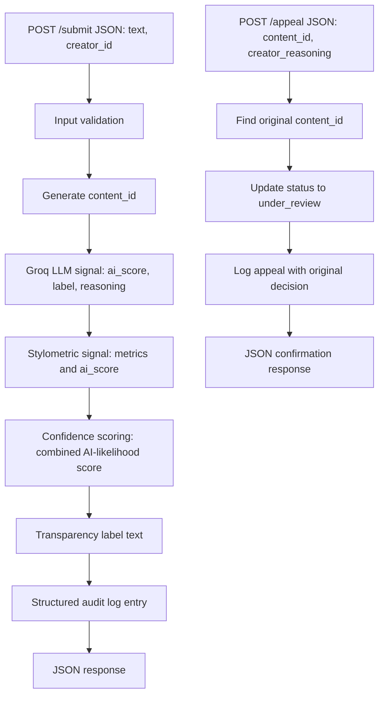

# Provenance Guard Planning

## Project Overview

Provenance Guard is a backend service for a creative writing platform. It accepts text submissions, estimates whether a piece is likely AI-generated, likely human-written, or uncertain, returns a confidence score, displays a reader-facing transparency label, supports creator appeals, rate-limits submissions, and writes structured audit logs.

The primary users are creative platform developers, trust and safety reviewers, creators submitting their work, and readers who need clear context about provenance. False positives against human writers are especially harmful because they can damage reputation, discourage participation, and wrongly shift the burden of proof onto the creator. The system therefore uses a wide uncertainty band and explicit appeal workflow instead of treating a detector score as a final judgment.

## Architecture



Submission flow: a creator sends `text` and `creator_id` to `POST /submit`; the API validates the request, creates a unique `content_id`, runs both detection signals, combines them into one AI-likelihood confidence score, maps the score to an attribution and transparency label, writes the full decision to the audit log, and returns a structured JSON response.

Appeal flow: a creator sends `content_id` and `creator_reasoning` to `POST /appeal`; the API finds the original decision, updates the content status to `under_review`, writes an appeal entry alongside the original decision details, and returns a confirmation for human review.

## Detection Signals

### Signal 1: Groq LLM Classification

- What it measures: holistic semantic and stylistic cues that may indicate generated text, including generic phrasing, overly balanced structure, formulaic transitions, and model-like explanation patterns.
- Expected output format: JSON with `label`, `ai_score` from 0 to 1, `reasoning`, and `status`.
- Why it helps: an LLM can evaluate rhetorical flow and semantic texture that simple statistics may miss.
- Blind spots: LLM judgments are not proof, can be overconfident, may misread formal human writing, and may fail if the API key or network is unavailable.

### Signal 2: Stylometric Heuristics

- What it measures: structural text properties including sentence length variance, type-token ratio, punctuation density, average sentence length, and repetition.
- Expected output format: JSON with `ai_score` from 0 to 1, `metrics`, `reasoning`, and `status`.
- Why it helps: generated prose often has more uniform sentence lengths, lower punctuation variety, smoother average sentence length, and repeated transition language.
- Blind spots: formal academic prose, repetitive poetry, simple beginner writing, or non-native English may look statistically "AI-like"; heavily edited AI text may look human.

These signals are genuinely distinct because the Groq signal is a semantic model judgment, while stylometrics are pure Python measurements of surface structure. Combining them is more informative than asking the same kind of detector twice.

## Confidence Scoring and Uncertainty

The combined score is an AI-likelihood score: higher means the submission is more likely AI-generated. The first version uses:

```text
combined = 0.65 * groq_ai_score + 0.35 * stylometric_ai_score
```

If the two signals strongly disagree, the score is nudged toward `0.5` to avoid overclaiming. If the Groq API fails, the system records a fallback status in the audit log and uses a local development estimate so the API can still be tested without exposing an API key.

Thresholds:

| Score Range | Attribution |
|---|---|
| `0.00` to `0.35` | `likely_human` |
| `0.36` to `0.74` | `uncertain` |
| `0.75` to `1.00` | `likely_ai` |

The wide uncertainty band reflects the idea that false positives against human writers are worse than false negatives. The system should only show a high-confidence AI label when the combined evidence is strong.

## Transparency Label Design

| Variant | Exact Label Text |
|---|---|
| High-confidence AI | "Transparency notice: This submission appears likely to be AI-generated. The system is confident, but this is not a final judgment and the creator may appeal." |
| High-confidence human | "Transparency notice: This submission appears likely to be human-written. The system found limited signs of AI generation, but no detector is perfect." |
| Uncertain | "Transparency notice: This submission has mixed signals, so we are not labeling it as clearly AI-generated or clearly human-written. A creator appeal is available if needed." |

These exact strings must appear in the API response and README.

## Appeals Workflow

Any creator with a returned `content_id` can appeal a classification. The appeal request requires:

- `content_id`
- `creator_reasoning`

When an appeal is received, the content status changes from `classified` to `under_review`. The audit log records the appeal timestamp, appeal reasoning, original attribution, original confidence, original signal scores, and updated status. A human reviewer would see the content ID, creator ID, original decision, label, individual signal scores, stylometric metrics, and the creator's explanation.

## Rate Limiting Plan

`POST /submit` uses `10 per minute;100 per day` with Flask-Limiter and `storage_uri="memory://"`.

These limits are realistic for a creator because a writer may test several drafts in a short session but is unlikely to submit more than 10 full pieces per minute. The limits reduce abuse by slowing scripts that try to flood the detector or burn Groq API quota.

## Edge Cases and Limitations

- Formal human academic writing may look AI-generated because it often has balanced sentence structure, abstract vocabulary, and low punctuation variety.
- Simple repetitive poetry may trigger stylometric false positives because repetition and short sentence patterns can look formulaic.
- Heavily edited AI text may look human because editing can add irregularity and personal detail.
- Non-native English writing may be misread by style-based signals because unusual phrasing can resemble detector artifacts even when fully human.

## AI Tool Plan

### M3: Submission Endpoint and First Signal

- Ask AI/Codex to generate: Flask app skeleton, `POST /submit`, request validation, unique `content_id`, standalone Groq signal function, simple audit log, and `GET /log`.
- Spec sections provided: Architecture, Groq LLM Classification, Confidence Scoring fallback behavior.
- Verification: call the Groq function independently, submit valid and invalid JSON, confirm response fields and audit entries.

### M4: Second Signal and Confidence Scoring

- Ask AI/Codex to generate: stylometric signal function, measurable metrics, `combine_scores()`, and attribution thresholds.
- Spec sections provided: Detection Signals, Confidence Scoring and Uncertainty, Architecture.
- Verification: run four sample inputs and confirm individual signal scores plus combined confidence vary meaningfully.

### M5: Production Layer

- Ask AI/Codex to generate: label mapping, `POST /appeal`, complete audit fields, Flask-Limiter setup, and rate-limit test commands.
- Spec sections provided: Transparency Label Design, Appeals Workflow, Rate Limiting Plan, Architecture.
- Verification: reach all three label variants, submit a valid and invalid appeal, confirm `under_review` status in `GET /log`, and capture 429 output.

### Documentation

- Ask AI/Codex to generate: README sections, curl examples, audit-log samples, AI usage reflection, spec reflection, and final audit.
- Spec sections provided: the complete `planning.md`, CodePath requirements, and sample outputs.
- Verification: use ripgrep to confirm required headings and exact label strings, then run the documented commands.
